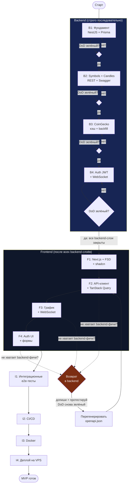
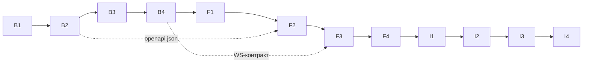

# Trading Dashboard — ROADMAP (MVP)

> Пошаговый план реализации MVP с жёсткой дисциплиной послойной разработки.
> Основан на [ARCHITECTURE.md](./ARCHITECTURE.md). Каждый слой закрывается только зелёными тестами.

**Версия документа:** 1.0
**Темп:** 2–3 часа в день. Оценки времени даны в часах чистой работы.

---

## 1. Общие принципы

- **Послойная разработка.** Сначала полностью завершаем и тестируем backend-слои, затем — frontend-слои. Frontend не стартует, пока все backend-слои не прошли Definition of Done (DoD).
- **Слой = milestone.** Каждый слой — отдельная веха с чётким DoD. Слой считается завершённым только после того, как покрыт тестами.
- **Никакого перехода вперёд без зелёных тестов.** Переход к следующему слою запрещён, пока текущий не прошёл DoD полностью.
- **Тесты сразу после (или до) реализации фичи.** TDD применяется там, где это уместно (чистая бизнес-логика: сервисы, адаптеры, кэш, схемы Zod). Для транспортных/интеграционных слоёв допустим write-then-test в рамках одного milestone.
- **Возврат назад разрешён и ожидаем.** Если во frontend-разработке обнаруживается недостающая backend-функциональность — возвращаемся в соответствующий backend-слой, дописываем **и тестируем**, затем продолжаем frontend (см. раздел 4).
- **CI — единственный арбитр.** Красный CI блокирует merge. «Работает локально» не является завершением слоя, если CI красный.

### Definition of Done (общий чек-лист слоя)

Слой закрыт, когда **все** пункты зелёные:

- [ ] Реализована функциональность слоя согласно ARCHITECTURE.md.
- [ ] Написаны unit-тесты (Jest для backend, Vitest для frontend).
- [ ] Написаны интеграционные / e2e тесты для ключевых сценариев слоя.
- [ ] `lint` проходит без ошибок.
- [ ] `type-check` (`tsc --noEmit`) проходит без ошибок.
- [ ] Все тесты проходят локально.
- [ ] **Backend:** Swagger-документация обновлена; `/health` работает (для слоёв, где он существует).
- [ ] **Frontend:** страница/компонент рендерится; TanStack Query и Zod-валидация на месте (где применимо).

---

## 2. Слои разработки (последовательно)

### 2.1 Таблица слоёв

| # | Слой | Ключевые задачи | Definition of Done (сверх общего) | Зависимости | Оценка, ч |
|---|---|---|---|---|---|
| **B1** | Фундамент NestJS + Prisma | `nest new`, strict TS, ESLint/Prettier; `ConfigModule` + Zod-валидация env; `schema.prisma` (User, Symbol, Candle) + миграция + `seed.ts`; `PrismaModule`/`PrismaService` с lifecycle-хуками; `HealthModule` (`GET /health`); глобальный `ValidationPipe`, `AllExceptionsFilter`, `nestjs-pino` | unit-тест health-check; e2e-тест старта приложения (bootstrap); `prisma migrate deploy` проходит в CI; старт fail-fast при отсутствии `DATABASE_URL` | — | 10–14 |
| **B2** | Symbols + Candles (REST) | Модули `symbols`, `candles`; контроллеры с DTO + `class-validator`; сервисы + репозитории (Prisma); `GET /symbols`, `GET /symbols/:ticker`, `GET /candles`, `GET /candles/latest`; Swagger на всех эндпоинтах; `openapi:export` | unit-тесты сервисов (границы диапазонов, пустая история); e2e-тесты контроллеров (Supertest): 200/400/404, `whitelist` отбрасывает лишние поля; все эндпоинты в Swagger; `openapi.json` генерируется | B1 | 12–16 |
| **B3** | CoinGecko + кэш + backfill | `CoinGeckoClient` (timeout, retry, token bucket, circuit breaker); `CoinGeckoAdapter` (маппинг + Zod); `CoinGeckoCache` (TTL 60s + single-flight); `@nestjs/throttler`; `CandleSyncScheduler`; CLI `backfill.ts`; флаг `stale` | unit-тесты адаптера (mock fetch через `nock`, битые payload'ы); тест кэша (TTL, single-flight: 10 вызовов → 1 запрос); тест backfill-скрипта (идемпотентность, exit code); тест throttler (429) | B2 | 14–18 |
| **B4** | Auth (JWT) + WebSocket-шлюз | `AuthModule` (argon2, register/login/refresh/logout/me); `JwtStrategy`, глобальный `JwtAuthGuard` (`APP_GUARD`), `@Public()`, `@CurrentUser()`, `RolesGuard`; `CandlesGateway` (socket.io, rooms, snapshot, heartbeat, disconnect); `WsJwtGuard`; `events.contract.ts` | unit-тесты auth-сервиса (хэш, невалидный refresh, ротация); e2e-тест защищённого эндпоинта (401 без токена / 200 с токеном / 403 для не-админа); тест WS: `subscribe`→`snapshot`, heartbeat, очистка при disconnect | B3 | 14–18 |
| **F1** | Фундамент Next.js + FSD + shadcn | `create-next-app` (App Router, TS); FSD-структура (`app/`, `pages/`, `widgets/`, `features/`, `entities/`, `shared/`); ESLint `boundaries`; shadcn/ui в `shared/ui/`; Zod-валидация env; Figma MCP + `figma.mdc` + выгрузка токенов | Vitest настроен; unit-тест базового компонента (RTL); страница-заглушка рендерится; нарушение слоёв ломает lint; отсутствие `NEXT_PUBLIC_API_URL` ломает `next build` | B4 | 10–14 |
| **F2** | API-клиент + TanStack Query | Генерация клиента `@hey-api/openapi-ts` из `openapi.json`; `predev`/`prebuild` хуки; `shared/api/client.ts` (auth-интерцептор); `QueryClientProvider` с дефолтами; хуки для свечей и символов | unit-тест хука с моком API (MSW): loading→success→error; `tsc --noEmit` на сгенерированном клиенте зелёный; `generated/` в `.gitignore` | F1 | 8–12 |
| **F3** | График + lightweight-charts + WebSocket | Страница графика (Server/Client Components); `widgets/candle-chart` (lightweight-charts, тема из CSS-переменных); `features/subscribe-candles` (socket.io-client, `setQueryData`, реконнект + `invalidateQueries`); Zod-валидация WS-payload | component-тест виджета (Vitest + RTL, мок `lightweight-charts`); тест хука подписки на WS-события; e2e/integration загрузки страницы и отображения свечей (MSW) | F2 | 14–18 |
| **F4** | Auth UI + формы | Страницы `login`/`register`; `features/auth-login` (react-hook-form + zodResolver); JWT-хранение, refresh при 401; обработка ошибок; `widgets/market-header`, `symbol-list` | unit-тесты форм (валидация, submit, ошибки); e2e-тест входа/выхода (login → защищённая зона → logout) | F3 | 10–14 |

### 2.2 Backend-слой 1 — Фундамент NestJS + Prisma

**Задачи**
- Инициализация NestJS-проекта (`nest new backend`), strict TypeScript, ESLint + Prettier, каркас `common/`, `config/`, `modules/`.
- `ConfigModule` (global) + Zod-схема env (`env.validation.ts`) с fail-fast на старте.
- Подключение Prisma: модели `User`, `Symbol`, `Candle` (см. ARCHITECTURE §4.3), первая миграция, `seed.ts` на 5 символов (BTC, ETH, SOL...).
- `PrismaModule`/`PrismaService` с `onModuleInit`/`onModuleDestroy`, `$connect`.
- Health-check эндпоинт `GET /health` (вне глобального префикса, `@nestjs/terminus`, `SELECT 1`).
- Глобальный `ValidationPipe` (`whitelist`, `forbidNonWhitelisted`, `transform`), `AllExceptionsFilter`, `nestjs-pino`, `enableShutdownHooks()`.

**Definition of Done**
- unit-тест для health-check;
- e2e-тест запуска приложения (bootstrap, `/health` → 200);
- Prisma-миграция (`prisma migrate deploy`) проходит в CI;
- старт падает с внятным сообщением при отсутствии `DATABASE_URL`.

### 2.3 Backend-слой 2 — Symbols + Candles (REST)

**Задачи**
- Модули `symbols`, `candles` (Controller → Service → Repository).
- Контроллеры с DTO + `class-validator` (`GetCandlesQueryDto` и др., см. §4.7).
- Сервисы (бизнес-логика: границы диапазонов) + репозитории (Prisma, только этот слой знает Prisma-типы).
- Эндпоинты: `GET /symbols`, `GET /symbols/:ticker`, `GET /candles`, `GET /candles/latest`.
- Swagger на всех эндпоинтах (`@ApiOperation`, `@ApiOkResponse`, примеры в DTO); `DocumentBuilder`, `jsonDocumentUrl: 'docs-json'`.
- Скрипт `openapi:export` (спека без `listen()`).

**Definition of Done**
- unit-тесты сервисов (границы диапазонов, пустая история);
- e2e-тесты контроллеров (Supertest): 200/400/404, `whitelist` отбрасывает лишние поля;
- все эндпоинты задокументированы в Swagger, `/docs-json` отдаёт валидный OpenAPI 3;
- `backend/openapi.json` генерируется одной командой.

### 2.4 Backend-слой 3 — CoinGecko + кэш + backfill

**Задачи**
- Адаптер CoinGecko в `integrations/coingecko/`: `CoinGeckoClient` (timeout 8s, retry 3x backoff+jitter только на 429/5xx, header `x-cg-demo-api-key`, token bucket 50 req/min, respect `Retry-After`, circuit breaker).
- `CoinGeckoAdapter`: маппинг `[ts,o,h,l,c]` → `Candle`, Zod-валидация внешнего ответа, маппинг `days` → `CandleInterval`.
- In-memory cache `CoinGeckoCache` (TTL 60s) + single-flight; rate limiting через `@nestjs/throttler` (`short`/`medium`/`long`, `trust proxy`).
- `CandleSyncScheduler` (cron 60s) + bulk upsert; graceful degradation (флаг `stale`).
- CLI-скрипт `backfill.ts`: `--symbols`, `--days`, `--all`, `--dry-run`, `--resume`, отчёт, exit code.

**Definition of Done**
- unit-тесты адаптера (mock fetch через `nock`: retry срабатывает, 4xx не ретраится, битый payload → ошибка);
- тест кэша (TTL 60s, single-flight: 10 параллельных вызовов → 1 внешний запрос);
- тест backfill-скрипта (повторный прогон не создаёт дублей, exit code 1 при ошибке);
- тест throttler (флуд → 429 + `Retry-After`).

### 2.5 Backend-слой 4 — Auth (JWT) + WebSocket-шлюз

**Задачи**
- JWT auth через `@nestjs/jwt` + `@nestjs/passport`: `argon2`, access 15m (Bearer) + refresh 7d (httpOnly cookie, hash в `User.refreshHash`), `register`/`login`/`refresh`/`logout`/`me`.
- Guard для защищённых эндпоинтов: глобальный `JwtAuthGuard` (`APP_GUARD`), `@Public()`, `@CurrentUser()`, `RolesGuard` + `@Roles(ADMIN)` на `POST /candles/sync`; `@Throttle` 3/мин на login; Swagger `addBearerAuth`.
- WebSocket-шлюз `CandlesGateway` (socket.io, namespace `/ws/candles`): `subscribe`/`unsubscribe`, rooms `TICKER:INTERVAL`, `candle:snapshot`, broadcast `candle:update`, heartbeat (транспортный + прикладной), обработка disconnect; `WsJwtGuard`; `events.contract.ts`.

**Definition of Done**
- unit-тесты auth-сервиса (хэш пароля, невалидный refresh, ротация/отзыв);
- e2e-тест защищённого эндпоинта (401 без токена / 200 с токеном / 403 для не-админа);
- тест WebSocket-подключения и отключения (`subscribe`→`snapshot`, heartbeat >2 мин, очистка состояния при 100 циклах connect/disconnect).

### 2.6 Frontend-слой 1 — Фундамент Next.js + FSD + shadcn

**Задачи**
- Инициализация Next.js (App Router), TypeScript, alias `@/*`.
- FSD-структура: `app/`, `pages/`, `widgets/`, `features/`, `entities/`, `shared/`; ESLint `eslint-plugin-boundaries` на направление импортов.
- Подключение shadcn/ui (`components.json` с alias на `shared/ui`), базовые компоненты (`button`, `card`, `select`).
- Zod для валидации env (`shared/config/env.ts`) и форм.
- Figma MCP (`.cursor/mcp.json` + `figma.mdc`), выгрузка токенов → `design-tokens.json` → `globals.css` → `tailwind.config.ts`.

**Definition of Done**
- Vitest настроен (`jsdom`, `setupFiles`, `@testing-library/jest-dom`);
- unit-тест базового компонента (RTL);
- страница-заглушка рендерится;
- нарушение слоёв (`shared` → `features`) ломает lint;
- отсутствие `NEXT_PUBLIC_API_URL` ломает `next build`.

### 2.7 Frontend-слой 2 — API-клиент + TanStack Query

**Задачи**
- Генерация API-клиента через `@hey-api/openapi-ts` из Swagger-спеки backend (`openapi-ts.config.ts`, плагины `client-fetch`, `sdk`, `typescript`, `@tanstack/react-query`).
- `predev`/`prebuild` хуки; `shared/api/client.ts` (baseUrl, auth-интерцептор, retry через `/auth/refresh` на 401).
- Настройка TanStack Query provider (`staleTime` 30s, retry без 4xx, `refetchOnWindowFocus`).
- Хуки для получения свечей и символов (`getCandlesOptions`, `getSymbolsOptions`).

**Definition of Done**
- unit-тест хука с моком API (MSW): loading → success → error;
- проверка типов сгенерированного клиента (`tsc --noEmit` зелёный);
- `generated/` в `.gitignore`, клиент генерируется из `/docs-json` или `openapi.json`.

### 2.8 Frontend-слой 3 — График + lightweight-charts + WebSocket

**Задачи**
- Страница графика: `app/dashboard/[symbol]/page.tsx` (Server Component: `prefetchQuery` + `HydrationBoundary`), `pages/dashboard`.
- Виджет графика на `lightweight-charts` в `widgets/candle-chart/` (Client Component, тема из CSS-переменных).
- `features/subscribe-candles`: подключение socket.io-client для live-обновлений, `setQueryData` на `candle:update`, реконнект + `invalidateQueries`.
- Zod-валидация ответов WebSocket (`candleUpdateSchema`).
- `features/select-timeframe` с синхронизацией в URL search params.

**Definition of Done**
- component-тест виджета графика (Vitest + RTL, мок `lightweight-charts`);
- тест хука подписки (реакция на WS-события, Zod отклоняет битый payload);
- e2e/integration тест загрузки страницы и отображения свечей (MSW).

### 2.9 Frontend-слой 4 — Auth UI + формы

**Задачи**
- Страницы `login`/`register`.
- `features/auth-login` (react-hook-form + `zodResolver`).
- JWT-хранение, refresh при необходимости (интерцептор на 401).
- Zod-валидация форм, обработка ошибок (в т.ч. 401/409 от backend).
- `widgets/market-header`, `widgets/symbol-list`.

**Definition of Done**
- unit-тесты форм (валидация полей, submit, отображение ошибок);
- e2e-тест входа/выхода (login → защищённая зона → logout).

---

## 3. Финальные слои (интеграция и деплой)

| # | Слой | Ключевые задачи | Definition of Done | Зависимости | Оценка, ч |
|---|---|---|---|---|---|
| **I1** | Интеграционный слой | Сквозные e2e-тесты полного сценария: `login` → загрузка графика → получение свечей (REST) → live-обновление (WS) → переживание разрыва сети | все e2e-тесты полного сценария зелёные | F4 | 8–12 |
| **I2** | CI/CD | GitHub Actions: `backend.yml` (сервис postgres, lint → test → build → артефакт `openapi.json`), `frontend.yml` (generate client → `tsc --noEmit` → lint → `tokens:check` → test → build), path-фильтры | CI проходит на PR; красный CI блокирует merge; несовместимое изменение контракта ломает сборку фронта | I1 | 6–10 |
| **I3** | Docker | `backend/Dockerfile` (multi-stage, non-root, `migrate deploy`), `frontend/Dockerfile` (`output: standalone`), `docker-compose.yml` (postgres + backend + frontend, healthchecks, `depends_on: service_healthy`), `docker-compose.prod.yml` | `docker compose up` поднимает приложение одной командой | I2 | 8–12 |
| **I4** | Деплой | Инструкция для VPS (Hetzner): ufw, ssh-hardening, docker, `deploy.yml` (build+push в GHCR, ssh-деплой, `migrate deploy`, smoke `/health`, откат); либо Railway/Vercel | `docker compose up` на сервере поднимает приложение; `/health` зелёный; README с инструкцией | I3 | 8–12 |

**Общий DoD финальных слоёв:** все e2e-тесты зелёные, CI проходит, `docker compose up` поднимает приложение, README с инструкцией написан.

**Критерии готовности MVP** (из ARCHITECTURE §8): график BTC/ETH/SOL рисуется на трёх таймфреймах; live-обновления приходят по WS и переживают разрыв сети; регистрация/логин работают; `/health` зелёный; CI гоняет lint+test+build на каждом PR; деплой автоматизирован; при недоступном CoinGecko приложение продолжает работать на данных БД.

---

## 4. Порядок выполнения и зависимости

### 4.1 Правила

- **Backend-слои выполняются строго последовательно:** B1 → B2 → B3 → B4. Каждый следующий стартует только после зелёного DoD предыдущего.
- **Frontend-слои начинаются только после завершения всех backend-слоёв** (B1–B4 закрыты). Причина: F2 генерирует типизированный клиент из финальной Swagger-спеки, а F3 зависит от готового WS-контракта из B4.
- **Frontend-слои последовательны:** F1 → F2 → F3 → F4.
- **Финальные слои** (I1–I4) идут после F4, тоже последовательно.
- **Возврат в backend.** Если в процессе frontend-разработки обнаруживается недостающая backend-функциональность — возвращаемся в соответствующий backend-слой, **дописываем и тестируем (DoD снова зелёный)**, перегенерируем `openapi.json`, затем продолжаем frontend. Такой возврат не пропускает тесты: изменённый backend-слой снова проходит полный DoD.

### 4.2 Mermaid-диаграмма последовательности слоёв

### 4.3 Граф зависимостей (кратко)

---

## 5. Чек-листы слоёв

> Каждый чек-лист = общий DoD (раздел 1) + специфика слоя. Слой закрыт при всех отмеченных пунктах.

### B1 — Фундамент NestJS + Prisma
- [ ] `nest new backend`, strict TS, ESLint + Prettier настроены.
- [ ] `ConfigModule` + Zod-валидация env (fail-fast).
- [ ] `schema.prisma` (User, Symbol, Candle), миграция, `seed.ts` (5 символов).
- [ ] `PrismaModule`/`PrismaService` с lifecycle-хуками.
- [ ] `GET /health` (`@nestjs/terminus`, `SELECT 1`).
- [ ] Глобальные `ValidationPipe`, `AllExceptionsFilter`, `nestjs-pino`.
- [ ] unit-тест health-check + e2e-тест bootstrap.
- [ ] `prisma migrate deploy` в CI, старт fail-fast без `DATABASE_URL`.
- [ ] lint + type-check + тесты зелёные локально.

### B2 — Symbols + Candles (REST)
- [ ] Модули `symbols`, `candles`: Controller → Service → Repository.
- [ ] DTO + `class-validator`, глобальный `ValidationPipe`.
- [ ] `GET /symbols`, `/symbols/:ticker`, `/candles`, `/candles/latest`.
- [ ] Swagger на всех эндпоинтах + примеры в DTO.
- [ ] `openapi:export` → `openapi.json`.
- [ ] unit-тесты сервисов + e2e (Supertest) 200/400/404, whitelist.
- [ ] lint + type-check + тесты зелёные локально.

### B3 — CoinGecko + кэш + backfill
- [ ] `CoinGeckoClient` (timeout, retry, token bucket, `Retry-After`, circuit breaker).
- [ ] `CoinGeckoAdapter` (маппинг + Zod, `days` → `CandleInterval`).
- [ ] `CoinGeckoCache` (TTL 60s + single-flight).
- [ ] `@nestjs/throttler` (`short`/`medium`/`long`, `trust proxy`).
- [ ] `CandleSyncScheduler` (cron 60s) + флаг `stale`.
- [ ] CLI `backfill.ts` (`--symbols`/`--days`/`--all`/`--dry-run`/`--resume`).
- [ ] unit-тесты адаптера (`nock`), кэша (single-flight), backfill, throttler (429).
- [ ] lint + type-check + тесты зелёные локально.

### B4 — Auth (JWT) + WebSocket
- [ ] `AuthModule` (argon2, register/login/refresh/logout/me).
- [ ] Глобальный `JwtAuthGuard`, `@Public()`, `@CurrentUser()`, `RolesGuard`.
- [ ] `@Throttle` 3/мин на login, Swagger `addBearerAuth`.
- [ ] `CandlesGateway` (rooms, snapshot, `candle:update`, heartbeat, disconnect).
- [ ] `WsJwtGuard`, `events.contract.ts`.
- [ ] unit-тесты auth-сервиса + e2e защищённого эндпоинта (401/200/403).
- [ ] тест WS-подключения/отключения (snapshot, heartbeat, очистка).
- [ ] lint + type-check + тесты зелёные локально; Swagger обновлён; `/health` работает.

### F1 — Next.js + FSD + shadcn
- [ ] `create-next-app` (App Router, TS), alias `@/*`.
- [ ] FSD-каталоги + ESLint `boundaries`.
- [ ] shadcn/ui в `shared/ui/` (`components.json`).
- [ ] Zod-валидация env + основа форм.
- [ ] Figma MCP + `figma.mdc` + выгрузка токенов → `globals.css` → Tailwind.
- [ ] Vitest настроен, unit-тест базового компонента, страница-заглушка рендерится.
- [ ] lint + type-check + тесты зелёные локально.

### F2 — API-клиент + TanStack Query
- [ ] `openapi-ts.config.ts` + генерация клиента; `predev`/`prebuild`.
- [ ] `shared/api/client.ts` (auth-интерцептор, 401 → refresh).
- [ ] `QueryClientProvider` с дефолтами.
- [ ] Хуки свечей/символов.
- [ ] unit-тест хука с моком API (MSW); `tsc --noEmit` на клиенте.
- [ ] `generated/` в `.gitignore`; lint + type-check + тесты зелёные.

### F3 — График + WebSocket
- [ ] Страница графика (Server prefetch + Client Component).
- [ ] `widgets/candle-chart` (lightweight-charts, тема из CSS-переменных).
- [ ] `features/subscribe-candles` (socket.io-client, `setQueryData`, реконнект).
- [ ] Zod-валидация WS-payload.
- [ ] `features/select-timeframe` (URL search params).
- [ ] component-тест виджета (мок lightweight-charts) + тест хука подписки.
- [ ] e2e/integration загрузки страницы и свечей (MSW).
- [ ] lint + type-check + тесты зелёные; страница рендерится, TanStack Query + Zod на месте.

### F4 — Auth UI + формы
- [ ] Страницы `login`/`register`.
- [ ] `features/auth-login` (react-hook-form + zodResolver).
- [ ] JWT-хранение, refresh при 401, обработка ошибок.
- [ ] `widgets/market-header`, `symbol-list`.
- [ ] unit-тесты форм + e2e входа/выхода.
- [ ] lint + type-check + тесты зелёные.

### I1–I4 — Финальные слои
- [ ] I1: сквозной e2e (login → график → свечи → live → разрыв сети) зелёный.
- [ ] I2: `backend.yml` + `frontend.yml`, path-фильтры, красный CI блокирует merge.
- [ ] I3: `docker compose up` поднимает postgres + backend + frontend с healthchecks.
- [ ] I4: деплой на VPS/Railway/Vercel, `/health` зелёный, README с инструкцией.

---